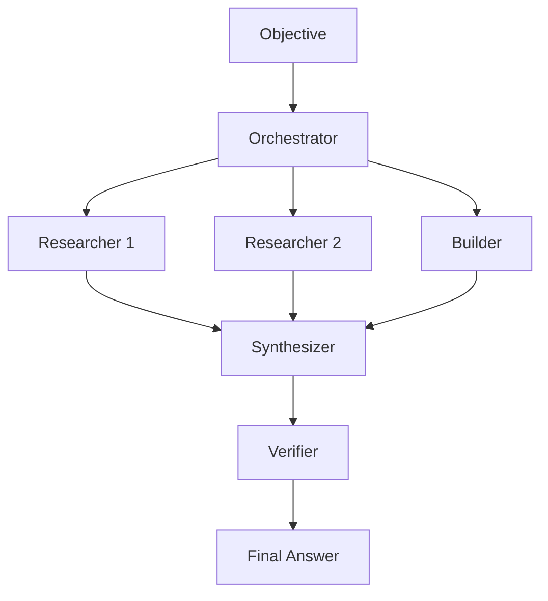

# LatticeAG PolyBrain 🧠

<p align="center">
  <a href="https://github.com/mosesman831/PolyBrain/blob/main/LICENSE">
    
  </a>
  <a href="https://www.python.org/">
    
  </a>
  <a href="https://github.com/mosesman831/PolyBrain/stargazers">
    
  </a>
  <a href="https://github.com/mosesman831/PolyBrain/issues">
    
  </a>
  <a href="https://github.com/mosesman831/PolyBrain">
    
  </a>
    <a href="https://github.com/MShawon/github-clone-count-badge">
      
  </a>
  <a href="https://github.com/MShawon/github-clone-count-badge">
    
  </a>
  
</p>

<p align="center">
  <b>A multi-agent, multi-model orchestration layer for Hermes Agent.</b><br/>
  Parallel research. Clean synthesis. Verified claims.
</p>

<p align="center">
  <a href="#quick-start">Quick Start</a> ·
  <a href="#why-polybrain">Why PolyBrain</a> ·
  <a href="#how-it-works">How It Works</a> ·
  <a href="#features">Features</a> ·
  <a href="#configuration">Configuration</a>
</p>

---

PolyBrain turns a single objective into a coordinated multi-agent workflow: it decomposes the task, routes work to specialized roles, executes subtasks in parallel, synthesizes the outputs, and verifies every claim against cited sources.

Inspired by the orchestration pattern behind Perplexity Computer - built as a local, config-driven, reproducible skill with a polished, high-trust workflow.

## Why PolyBrain

- **Designed for high-signal work** - built to keep outputs focused, sourced, and useful.
- **Parallel by default** - research and build tasks run concurrently to reduce wait time.
- **Source-first** - claims must be backed by citations, not vibes.
- **Verification built in** - final output is checked claim-by-claim before it reaches you.
- **Multi-model by design** - route different roles to different models/providers in `config.yaml`.

### How PolyBrain is different

- **Multi-model, not just multi-agent** - different roles can use different LLMs, not just different agents on the same model. Unlike Hermes's native `delegate_task` and Kanban - which spin up subagents but bind them all to the same model config - PolyBrain routes each role independently. Run DeepSeek for research, Claude for synthesis, GPT-4o for verification. Same pipeline, genuinely different brains.
- **Verification layer** - claims are checked against sources before the final answer is returned.
- **Citation enforcement** - uncited claims are dropped, not silently included.

## Quick Start

```bash
# 1. Clone and install
git clone --depth=1 https://github.com/mosesman831/PolyBrain.git /tmp/polybrain
rm -rf /tmp/polybrain/.git
cp -r /tmp/polybrain ~/.hermes/skills/research/polybrain
rm -rf /tmp/polybrain

# 2. Edit config.yaml with your model aliases
#    (orchestrator, researcher, builder, synthesizer, verifier, fallback)
hermes config edit  # then edit ~/.hermes/skills/research/polybrain/config.yaml

# 3. Validate config
python ~/.hermes/skills/research/polybrain/scripts/validate_config.py

# 4. Use it - just tell Hermes what you want in a chat:
"Use PolyBrain to research Apple's latest earnings and competitors"
# Hermes will load the skill and run the orchestration script for you.
```

For advanced/manual use, you can also run the script directly:
```bash
echo "Summarize Apple's latest quarterly earnings with sources" | \
  python ~/.hermes/skills/research/polybrain/scripts/orchestrate.py
```

## How It Works



## Features

- **Premium orchestration flow** - clean task splitting, parallel execution, and final synthesis.
- **Citation enforcement** - researchers must include URLs; uncited claims are dropped.
- **Source verification** - the verifier checks each claim against its source and returns PASS/FAIL.
- **Robust JSON parsing** - orchestrator output is recovered even when models add extra prose.
- **Retry logic** - transient failures are retried before the run is marked failed.
- **Role-based routing** - assign different models/providers per role in `config.yaml`.
- **Artifact logging** - every run is saved in a timestamped folder for traceability.

## Roles

| Role | Purpose | Toolsets |
|------|---------|----------|
| **Orchestrator** | Decompose objective into a JSON task plan | text-only |
| **Researcher** | Web search + citations | web, browser |
| **Builder** | Code, terminal, and file operations | terminal, file |
| **Synthesizer** | Merge outputs into the final deliverable | optional |
| **Verifier** | Verify claims against cited sources | web |

## Example

Tell Hermes:
```
Use PolyBrain to research Apple's latest quarterly earnings and competitors
```

Or run the script directly:
```bash
echo "Summarize Apple's latest quarterly earnings with sources" | \
  python ~/.hermes/skills/research/polybrain/scripts/orchestrate.py
```

### What you get

- A decomposed task plan
- Parallel research with citations
- A synthesized final brief
- Claim-by-claim verification

## Configuration

Edit `config.yaml`:

```yaml
models:
  orchestrator: "your-model"
  researcher: "your-model"
  builder: "your-model"
  synthesizer: "your-model"
  verifier: "your-model"
  fallback: "your-model"

providers:
  orchestrator: "your-provider"  # optional, set per-role if needed
  researcher: "your-provider"

settings:
  max_parallel: 3
  timeout_sec: 300
  orchestrator_timeout_sec: 120
  artifacts_dir: ".hermes/plans/polybrain"
```

See [`config.yaml`](config.yaml) for all options.

## Learn More

- [Architecture](references/architecture.md)
- [Prompt Templates](references/prompts.md)
- [JSON Schema](references/schema.json)
- [JSON Parsing Strategy](references/json-output-parsing.md)
- [Example Run](references/example-run.md)

## File Tree

```text
polybrain/
├── SKILL.md                          # Skill definition (Hermes)
├── README.md                         # This file
├── config.yaml                       # User-editable model configuration
├── references/
│   ├── architecture.md               # Design docs + data flow
│   ├── prompts.md                    # Versioned prompt templates
│   ├── schema.json                   # JSON schema for orchestrator output
│   ├── json-output-parsing.md        # JSON robustness strategy
│   └── example-run.md                # Example objective → final output
└── scripts/
    ├── orchestrate.py                # Production runner (parallel + sequential)
    ├── orchestrate_debug.py          # Debug runner (all sequential, verbose)
    └── validate_config.py            # Config validator
```

## Known Issues

- **Model-specific hangs** - Some models (e.g. `gpt-5-mini` via certain providers) can hang in `hermes chat` subagent calls. If a model hangs for 300s+, try a different model or provider. Test with `hermes chat -q "ping" -m your-model` first.
- **Verifier may truncate numbers** - Some models strip leading digits from dollar amounts in verification reports. The PASS/FAIL verdicts remain structurally valid.

## License

GNU General Public License version 3
